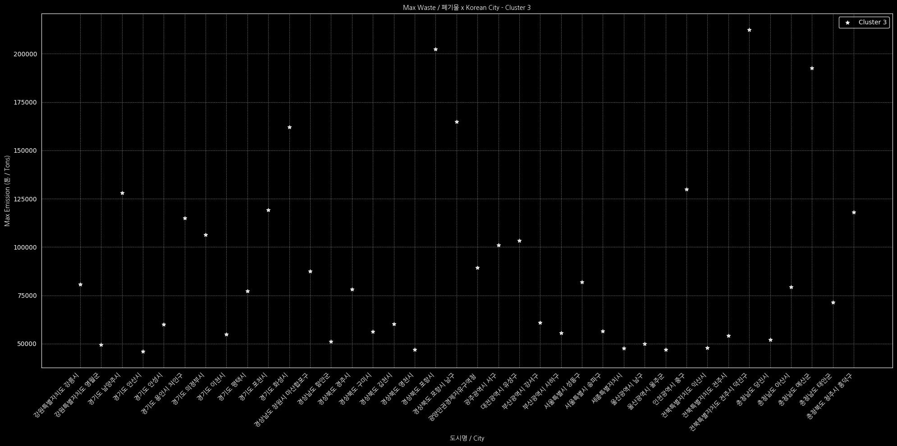

    

<h2 align="center">AI Model for Waste Volume Prediction and City Clustering (폐기물 예측 및 도시 군집화 AI 모델)</h2>

This dataset provides the volumes of waste across South Korean cities, recorded by the Korea Environment Corporation. It includes data on the amount of waste per city, categorized by corporation.

    <h2>Main Idea: Why It Matters</h2>
    <ul style="text-align: left; display: inline-block;">
        <li>Helps identify major <strong>waste-producing</strong> cities.</li>
        <li>Useful for waste management strategies and regulatory compliance monitoring.</li>
        <li>Supports environmental sustainability efforts by tracking waste discharge patterns.</li>
    </ul>

    <h2>Applications</h2>
    <ul style="text-align: left; display: inline-block;">
        <li><strong>Predictive modeling</strong> for waste generation trends.</li>
        <li><strong>Goverment policy</strong> support for reducing industrial waste impact.</li>
        <li><strong>City Classifier</strong> based on its emission.</li>
    </ul>

    <h2>Authors</h2>
    <ul style="text-align: left; display: inline-block;">
        <li><strong>Lead & Developer:</strong> Alejandro ~ 알렉산드로 </li>
        <li><strong>Research & Data Specialist:</strong> Aram ~ 아람 (Focused on Korean datasets & research analysis)</li>
    </ul>

## AI Website Details

<a href="https://allegsu.github.io/Samsung/"></img>AI details: Click here</a>

## Dataset  
This project uses the **Korea Environment Corporation dataset** (public & unrestricted).

##

