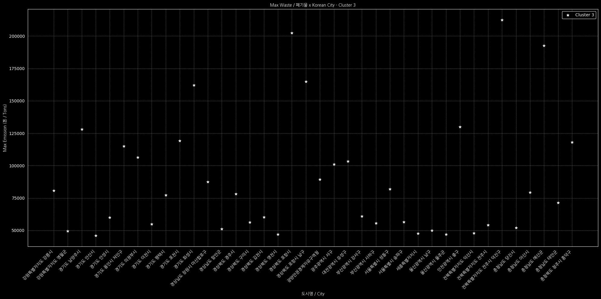
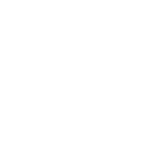
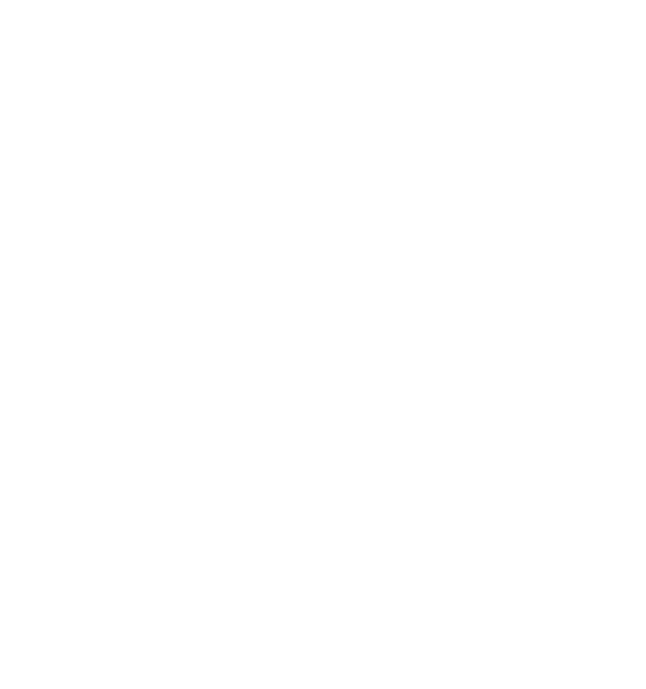
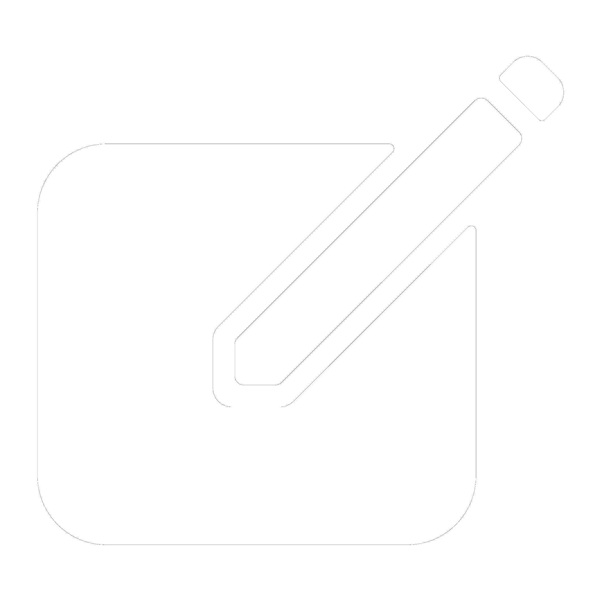
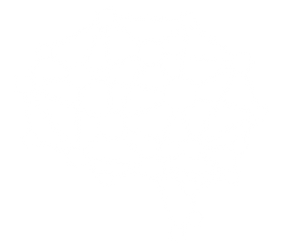
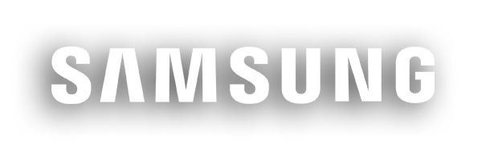

# AI 모델 - Waste Volume Prediction & City Clustering 

 This dataset provides the volumes of waste across South Korean cities, recorded by the Korea Environment Corporation. It includes data on the amount of waste per city, categorized by corporation.

## Future - Road Map 

- Helps identify major <strong>waste-producing</strong> cities
- Useful for waste management strategies and regulatory compliance monitoring.
- Supports environmental sustainability efforts by tracking waste discharge patterns.

## Applications

- <strong>Predictive modeling</strong> for waste generation trends.
- <strong>Goverment policy</strong> support for reducing industrial waste impact.
- <strong>City Classifier</strong> based on its emission.

## Authors

| Role | Name |
| :--- | :--- |
| <strong>Lead & Developer </strong>| **Alejandro** ~ 알렉산드로 |
| <strong>Research & Data Specialist </strong> | Aram ~ **아람** (Focused on Korean datasets & research analysis) |

## Website 

<a href="https://allegsu.github.io/Samsung/ "> Click here to find out more about this project!</a>

## Dataset 

This Project uses the **Korea Environment Corporation dataset** (public & unrestricted).

##

